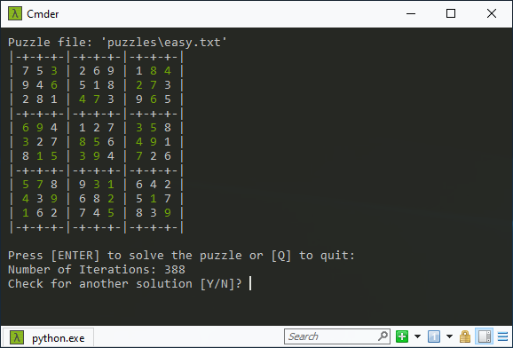

# 👀 Sudoku Solver - Python 3.8+
Simple Python Sudoku solver for Windows OS using backtracking algorithm and the great [Pandas package](https://pandas.pydata.org/docs/).



Note: Green numbers in the screenshot above represent input values from the [puzzle file](./puzzles/easy.txt).

## Requirements
- Windows OS (tested with Windows 10)
- Windows Terminal supporting ANSI Escape Sequences (for cursor positioning and colors)
- Python packages: pandas and csutils.cterm

## Installing required packages
The example below assumes you use Miniconda for managing your Python development environments. So the code may differ, if you use something differnt.

conda create -n sudoku python=3.8 pandas
conda activate sudoku
conda update pip
pip install git+git://github.com/cwsoft/csutils

## Basic usage
Prepare a textfile with a Sudoku puzzle you can´t solve or you are too lazy to do manually. A Sudoko puzzle file consists of numbers [0-9] placed in a 9x9 grid, where the number 0 indicates a free slot. The column numbers in each row needs to be  separated with a single space. Use # at the beginning of a line for adding comments to the puzzle file.

**Hint:** Invoke the script with *--interactive* to see the backtracking algorithm in action.

```bash
usage: sudoku.py [-h] [--space SPACE] [--interactive] sudokufile

positional arguments:
  sudokufile     Input file with Sudoku puzzle to solve.

optional arguments:
  -h, --help     show this help message and exit
  --space SPACE  Char used for free puzzle slots [Default: '.'].
  --interactive  Outputs each single step (may slowdown hard problems).
```

Have fun 
cwsoft